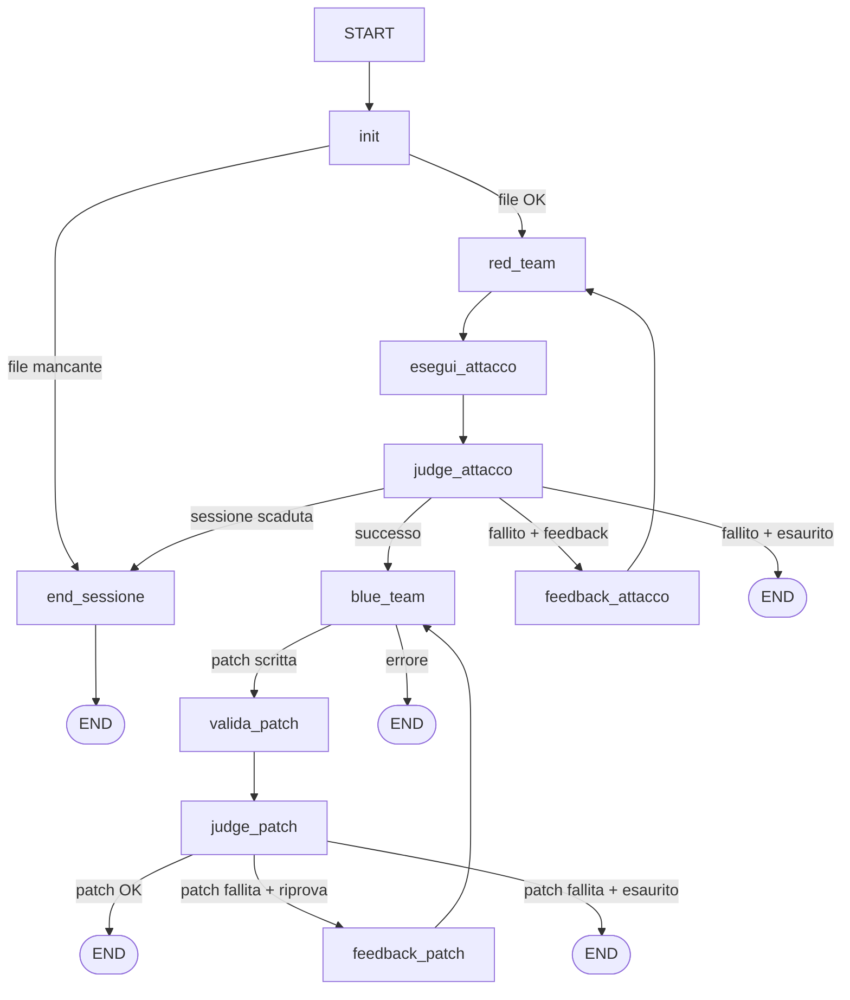

# dvwa-llm-agent


Sistema multi-agente adversariale su DVWA (Damn Vulnerable Web Application) che automatizza cicli Red Team / Blue Team con reasoning LLM e giudici autonomi, costruito con LangGraph.

---

## Grafo del flusso



---

## Architettura — Nodi

| # | Nodo | Ruolo | LLM |
|---|------|-------|-----|
| 1 | `node_init` | Legge `low.php` dal disco, resetta il DB DVWA ed effettua il login automatico per inizializzare la sessione | — |
| 2 | `node_red_team` | Genera payload SQL Injection iterativi | gpt-4o-mini |
| 3 | `node_esegui_attacco` | Invia il payload a DVWA via HTTP; conta `First name:` per determinare l'esito | — |
| 4 | `node_judge_attacco` | Ragiona sul perché l'attacco ha funzionato/fallito; fornisce tecnica e suggerimenti | gpt-4o |
| 5 | `node_feedback_attacco` | Inietta feedback del judge nello storico messaggi del red team | — |
| 6 | `node_blue_team` | Genera una patch in formato **Unified Diff**, ripristina il codice originale, la applica su disco ed esegue il controllo di sintassi PHP (`php -l`) | gpt-4o-mini |
| 7 | `node_feedback_patch` | Inietta problemi rilevati dal judge nella prossima iterazione del blue team | — |
| 8 | `node_valida_patch` | Resetta il DB e ri-esegue sia il **Security Test** (exploit) che il **Functional Regression Test** (business logic) per validare la patch | — |
| 9 | `node_judge_patch` | Valuta la qualità del codice patchato ed esprime il giudizio finale di conformità | gpt-4o |

---

## Quickstart

```bash
# 1. Clona la repo
git clone https://github.com/<your-org>/dvwa-llm-agent.git
cd dvwa-llm-agent

# 2. Configura le credenziali
cp api_keys.env.example api_keys.env
# Modifica api_keys.env:
#   - OPENAI_API_KEY → chiave OpenAI (o impostare LLM_PROVIDER su groq/gemini con relative chiavi)
#   - PHPSESSID → (Opzionale) Se vuoto o omesso, il sistema esegue il login automatico in autonomia

# 3. Avvia DVWA (se non è già attivo localmente su 127.0.0.1:4280)
docker compose up -d

# 4. Esegui l'agente
python main.py
```

> **Nota sulla Sessione**: Il sistema include un meccanismo di login automatico. All'avvio e ad ogni reset del database, l'agente effettua automaticamente il login con le credenziali standard (`admin` / `password`) per rigenerare e mantenere aggiornato il cookie `PHPSESSID`. Non è quindi richiesta alcuna operazione manuale di copia del cookie dal browser.

---

## Dipendenze

```bash
pip install -r requirements.txt
```

Richiede Python 3.11+.

---

## Test

```bash
pytest tests/ -v
```

I test non richiedono chiavi API — le chiamate LLM sono moccate con `unittest.mock`.

---

## LangSmith — Tracciamento

Con le variabili LangSmith configurate in `api_keys.env`, ogni run viene tracciata
automaticamente su [smith.langchain.com](https://smith.langchain.com):

```env
LANGCHAIN_TRACING_V2=true
LANGCHAIN_API_KEY=ls__...
LANGCHAIN_PROJECT=dvwa-llm-agent
```

Il tracciamento include ogni chiamata LLM, i token usati, la latenza e il grafo
di esecuzione completo. È fortemente consigliato per il debug e l'ottimizzazione
dei prompt.

---

## Struttura della repo

```
dvwa-llm-agent/
├── agent/
│   ├── __init__.py         # Package init
│   ├── state.py            # AgentState, JudgeAttaccoResult, JudgePatchResult
│   ├── prompts.py          # Tutte le stringhe di prompt come funzioni tipizzate
│   ├── nodes.py            # Tutti i nodi e le conditional edge functions
│   └── graph.py            # Costruzione e compilazione del grafo
├── tests/
│   └── test_judges.py      # Unit test per i due judge (pytest + mock)
├── main.py                 # Entrypoint CLI
├── docker-compose.yml      # Avvia DVWA su 127.0.0.1:4280
├── requirements.txt        # Dipendenze con versioni minime
├── api_keys.env.example    # Template variabili d'ambiente
└── README.md               # Questo file
```

---

## ⚠️ Disclaimer

> **Questo progetto è a scopo esclusivamente educativo.**
> DVWA è un'applicazione intenzionalmente vulnerabile progettata per l'apprendimento
> della sicurezza web in ambienti controllati.
> **Non esporre mai DVWA su reti pubbliche.**
> L'uso delle tecniche illustrate contro sistemi reali senza esplicita autorizzazione
> è illegale e contrario all'etica professionale.
