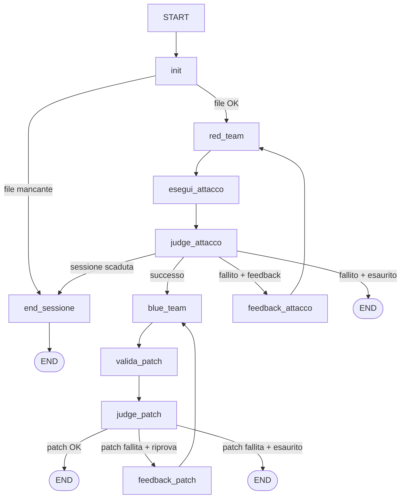

# dvwa-llm-agent


Sistema multi-agente adversariale su DVWA (Damn Vulnerable Web Application) che automatizza cicli Red Team / Blue Team con reasoning LLM e giudici autonomi, costruito con LangGraph.

---

## Grafo del flusso



---

## Architettura — Nodi

| # | Nodo | Ruolo |
|---|------|-------|
| 1 | `node_init` | Nodo di ingresso del grafo, eseguito una sola volta. Legge il sorgente PHP vulnerabile da `PATH_FILE_VULNERABILE` e lo salva in `state["codice_originale"]`. Se il file non esiste, imposta `sessione_scaduta=True` (usato come flag d'errore generico per uscire subito verso `END` tramite `decide_dopo_init`) e restituisce una stringa vuota. In caso di successo, elimina l'eventuale `patch_report.diff` residuo di una run precedente (`PATH_FILE_DIFF.unlink(missing_ok=True)`) e chiama `dvwa.reset_database()` per riportare il database DVWA a uno stato pulito e riproducibile prima di ogni run. |
| 2 | `node_red_team` | Genera un payload di SQL Injection tramite l'LLM configurato (`llm`). Al primo tentativo (`tentativo == 0`) costruisce una conversazione nuova con `prompt_red_team_iniziale()`; nei tentativi successivi riutilizza la cronologia messaggi esistente in `state["messages"]`, che include il feedback iniettato da `node_feedback_attacco`. Il payload viene estratto dalla risposta grezza dell'LLM con `_extract_payload`, e il contatore `tentativo` viene incrementato. |
| 3 | `node_esegui_attacco` | Nodo puramente deterministico, senza LLM: inoltra il payload generato a `dvwa.execute_sqli()`, che esegue la richiesta HTTP contro l'istanza DVWA live e determina l'esito controllando la presenza della stringa `First name:` nella risposta (indicatore di dati esfiltrati con successo). Il risultato (`attacco_successo`, `risposta_http_raw`) diventa la "ground truth" fattuale usata dai nodi giudice successivi. |
| 4 | `node_judge_attacco` | Chiede a un LLM giudice (`llm_judge`) di ragionare *sul perché* l'attacco ha avuto successo o è fallito, producendo motivazione, tecnica rilevata e un suggerimento per il tentativo successivo. Il giudizio dell'LLM non può mai contraddire il fatto osservato: dopo il parsing JSON, `result["successo"]` viene **forzato** al valore deterministico `state["attacco_successo"]` calcolato da `node_esegui_attacco`. Se il parsing della risposta LLM fallisce, viene costruito un risultato di fallback che preserva comunque la ground truth. |
| 5 | `node_feedback_attacco` | Nodo di routing/arricchimento eseguito solo quando l'attacco è fallito e ci sono ancora tentativi disponibili. Costruisce un messaggio `HumanMessage` che incorpora l'analisi del judge (motivazione, tecnica, suggerimento) e lo accoda a `state["messages"]`, in modo che `node_red_team` lo veda al giro successivo e generi un payload informato dal fallimento precedente. |
| 6 | `node_blue_team` | Il cuore della fase difensiva. Costruisce un prompt (diverso se è il primo tentativo o un retry con feedback dal judge della patch) e chiede all'LLM il **file PHP intero corretto** — non una diff. Il codice viene estratto con `_extract_php_code`, e se risulta vuoto o identico all'originale il tentativo viene scartato come fallito. Altrimenti il file viene scritto su disco (`PATH_FILE_VULNERABILE.write_text`), viene calcolato un unified diff con `difflib` a scopo di audit (non applicato con `patch`) e **salvato su `patch_report.diff`** (`PATH_FILE_DIFF.write_text`, sovrascritto a ogni tentativo — solo l'ultimo tentativo della run resta su disco), e infine il file viene validato sintatticamente con `php -l` (`_lint_php_file`): se il lint fallisce, il file originale viene ripristinato e il tentativo conta come fallimento. |
| 7 | `node_feedback_patch` | Nodo "waypoint" minimale, senza logica propria: si limita a stampare un messaggio di log. Il vero passaggio di contesto avviene perché `node_blue_team` legge direttamente `state["judge_patch"]` al retry successivo — questo nodo esiste solo per rendere esplicito nel grafo il passaggio "patch fallita → si ritenta". |
| 8 | `node_valida_patch` | Esegue la validazione a doppio controllo (**Dual-Verification**) richiesta dai criteri di successo del progetto. Prima resetta il database, poi ri-esegue lo stesso identico payload dell'exploit contro il codice appena patchato (**Security Test**) e lancia `dvwa.run_regression_tests()` per verificare che le funzionalità legittime (es. `id=1`) restituiscano ancora i risultati corretti (**Functional Regression Test**). Se il test di regressione fallisce, l'errore viene anteposto alla risposta HTTP grezza per dare contesto al judge successivo. |
| 9 | `node_judge_patch` | Ultimo nodo del ciclo difensivo: chiede all'LLM giudice di valutare la qualità del codice patchato (leggendolo direttamente da disco) e di esprimersi su problemi residui. Come per `node_judge_attacco`, il verdetto "funzionale" non è mai lasciato alla discrezione dell'LLM: viene forzato a `not state["attacco_successo"] and state["regression_test_passed"]`, cioè è vero solo se l'exploit è stato bloccato **e** i test funzionali sono passati. Il risultato determina il routing finale (`decide_dopo_judge_patch`): fine con successo, retry verso `node_feedback_patch`, oppure fine per esaurimento tentativi. |

---

## ⚠️ Prerequisito: clonare DVWA

Questa repo **non contiene DVWA** e non fornisce un proprio `docker-compose.yml`: l'agente legge e riscrive direttamente i sorgenti PHP di un checkout DVWA presente sul filesystem locale (per patchare `low.php`), oltre a parlare via HTTP con l'istanza live. Prima di eseguire `main.py`:

1. **Clona DVWA** (`https://github.com/digininja/DVWA`) in una delle due posizioni rilevate automaticamente da `agent/nodes.py`:

   ```bash
   # Opzione A — come sottocartella del progetto → ./DVWA
   git clone https://github.com/digininja/DVWA.git DVWA

   # Opzione B — come cartella "sibling", allo stesso livello del progetto → ../DVWA
   cd ..
   git clone https://github.com/digininja/DVWA.git
   cd dvwa-llm-agent
   ```

   L'ordine di risoluzione del percorso è: variabile d'ambiente `DVWA_PATH` (se impostata, punta alla root del checkout) → `./DVWA` → `../DVWA`. Se nessuno di questi contiene `vulnerabilities/sqli/source/low.php`, `node_init` fallisce subito (`sessione_scaduta=True`).

2. **Avvia DVWA** con il `docker-compose.yml` incluso nel repository DVWA stesso (non in questo progetto):

   ```bash
   cd DVWA   # o il percorso scelto al punto precedente
   docker compose up -d
   ```

   Verifica che risponda su `http://127.0.0.1:4280`; se usi host/porta diversi imposta `DVWA_BASE_URL` in `api_keys.env`.

3. Non serve nessuna configurazione manuale via browser: `node_init` chiama automaticamente `dvwa.reset_database()` a ogni avvio (crea/resetta il DB e fa login), e `DVWAClient` forza il cookie `security=low` su ogni richiesta — l'agente attacca e patcha specificamente `vulnerabilities/sqli/source/low.php`.

---

## Quickstart

```bash
# 1. Clona la repo
git clone https://github.com/<your-org>/dvwa-llm-agent.git
cd dvwa-llm-agent

# 2. Configura le credenziali
cp api_keys.env.example api_keys.env
# Modifica api_keys.env:
#   - OPENAI_API_KEY → chiave OpenAI (o impostare LLM_PROVIDER su groq/gemini con relative chiavi)
#   - Opzionale: DVWA_PATH e/o DVWA_BASE_URL se non usi le posizioni/porta di default

# 3. Assicurati che DVWA sia clonato e avviato (vedi sezione "Prerequisito: clonare DVWA" sopra)

# 4. Esegui l'agente
python main.py
```

> **Nota sulla sessione**: All'avvio e dopo ogni reset del database, l'agente effettua automaticamente il login con le credenziali standard (`admin` / `password`) e conserva il nuovo cookie esclusivamente in memoria per la durata della run.

---

## Metriche Valutazione

Al termine dell'esecuzione, l'agente calcola e stampa a schermo le seguenti metriche richieste:
* **Exploit Blocking Rate**: % di attacchi bloccati con successo.
* **Preservation of Business Logic**: % di test funzionali legittimi passati post-patch.
* **Patch Applicability**: % di patch (file PHP intero generato dall'LLM) scritte su disco con successo, senza codice vuoto o identico all'originale.
* **Syntax & Runtime Errors**: Numero di fallimenti di validazione sintattica PHP (`php -l`).
* **LLM Iterations**: Numero di tentativi e cicli necessari all'LLM per generare una patch valida.

---

## Dipendenze

```bash
pip install -r requirements.txt
```

Richiede Python 3.11+.

---

## Test

```bash
pytest tests/ -v
```

I test non richiedono chiavi API — le chiamate LLM sono moccate con `unittest.mock`.

---

## LangSmith — Tracciamento

Con le variabili LangSmith configurate in `api_keys.env`, ogni run viene tracciata
automaticamente su [smith.langchain.com](https://smith.langchain.com):

```env
LANGCHAIN_TRACING_V2=true
LANGCHAIN_API_KEY=ls__...
LANGCHAIN_PROJECT=dvwa-llm-agent
```

Il tracciamento include ogni chiamata LLM, i token usati, la latenza e il grafo
di esecuzione completo. È fortemente consigliato per il debug e l'ottimizzazione
dei prompt.

---

## Struttura della repo

```
dvwa-llm-agent/
├── agent/
│   ├── __init__.py         # Package init
│   ├── state.py            # AgentState, JudgeAttaccoResult, JudgePatchResult
│   ├── prompts.py          # Tutte le stringhe di prompt come funzioni tipizzate
│   ├── nodes.py            # Tutti i nodi e le conditional edge functions
│   ├── graph.py            # Costruzione e compilazione del grafo
│   └── dvwa_client.py      # Client HTTP per interazione con DVWA
├── tests/
│   └── test_judges.py      # Unit test per i due judge (pytest + mock)
├── main.py                 # Entrypoint CLI
├── requirements.txt        # Dipendenze con versioni minime
├── api_keys.env.example    # Template variabili d'ambiente
├── patch_report.diff       # Generato a runtime da node_blue_team (unified diff dell'ultimo tentativo), ripulito a ogni run — non versionato
└── README.md               # Questo file
```
